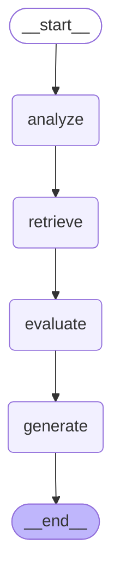
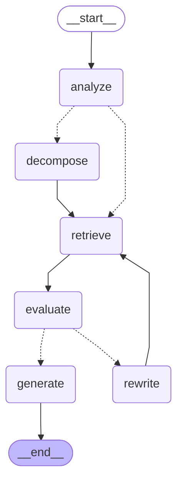

# LangGraph 设计与 Agent 评估

## 一、Graph 架构设计

### 1.1 整体架构

本项目采用 LangGraph 构建状态机驱动的 Agentic RAG Agent，通过条件分支和循环实现复杂推理流程。

### 1.2 两种 Graph 模式

#### Simple Graph (简单模式)

适用于简单查询，无分解和改写循环。



**流程：**
```
START → analyze → retrieve → evaluate → generate → END
```

#### Full Agent Graph (完整模式)

支持复杂查询的分解、检索评估和查询改写循环。



**流程：**
```
START → analyze
         ↓
    ┌────┴────┐
    ↓         ↓
decompose   retrieve (简单问题)
    ↓         ↓
    └────┬────┘
         ↓
      retrieve
         ↓
      evaluate
         ↓
    ┌────┴────┐
    ↓         ↓
generate   rewrite (不充分)
    ↓         ↓
   END    retrieve (重试)
```

**图例说明：**
- 实线 `-->` : 无条件跳转
- 虚线 `-.->` : 条件分支

---

## 二、节点详细说明

### 2.1 analyze (查询分析节点)

**职责：** 分析用户查询的复杂度和类型，决定后续处理路径。

**输入：**
- `original_query`: 用户原始问题

**输出：**
- `decision_path`: 决策路径记录
- `sub_queries`: 初始化为空列表

**处理逻辑：**

1. **复杂度判断** - 基于以下指标：
   - 关键词检测：`和`、`以及`、`比较`、`区别`、`如何`、`为什么` 等
   - 字数统计：超过 20 字为复杂
   - 问号数量：多个问号视为复杂

2. **类型识别**：
   | 类型 | 关键词 |
   |------|--------|
   | `factual` | 是什么、什么是、定义、概念 |
   | `procedural` | 如何、怎么、步骤、流程 |
   | `analytical` | 为什么、原因、导致、影响 |
   | `comparative` | 比较、区别、不同、相同 |
   | `general` | 其他 |

3. **分支决策**：
   - 复杂查询（比较类、分析类、多问题）→ `decompose`
   - 简单查询 → `retrieve`

**代码位置：** `src/agent/nodes/analyzer.py`

---

### 2.2 decompose (查询分解节点)

**职责：** 将复杂查询拆分为多个子查询，支持并行检索。

**输入：**
- `original_query`: 用户原始问题

**输出：**
- `sub_queries`: 子查询列表

**分解策略：**

1. **连接词分割**：按 `和`、`以及`、`另外`、`同时` 分割
2. **比较类拆分**：
   ```
   "A和B的区别" → ["什么是A", "什么是B", "A和B的区别"]
   ```
3. **步骤类拆分**：
   ```
   "如何X" → ["如何X", "X的步骤"]
   ```

**示例：**
| 原始查询 | 分解结果 |
|----------|----------|
| "机器学习和深度学习的区别" | ["什么是机器学习", "什么是深度学习", "机器学习和深度学习的区别"] |
| "如何部署模型以及如何监控" | ["如何部署模型", "如何监控"] |

**代码位置：** `src/agent/nodes/decomposer.py`

---

### 2.3 retrieve (检索节点)

**职责：** 从 RAG MCP Server 检索相关文档块。

**输入：**
- `original_query` 或 `rewritten_query`: 当前查询
- `sub_queries`: 子查询列表（可选）

**输出：**
- `chunks`: 检索结果列表
- `retrieval_score`: 平均检索分数

**处理流程：**

1. 获取查询列表（子查询或当前查询）
2. 对每个查询调用 RAG Server
3. 合并结果并去重（按 `chunk.id`）
4. 按 `score` 降序排序
5. 计算平均分数

**数据结构：**
```python
Chunk(
    id="doc_001",
    text="文档内容...",
    score=0.85,  # 相关性分数
    metadata={"source_path": "doc.pdf", "page_num": 1}
)
```

**代码位置：** `src/agent/nodes/retriever.py`

---

### 2.4 evaluate (检索评估节点)

**职责：** 评估检索结果是否足够回答问题，决定是否需要改写查询。

**输入：**
- `chunks`: 检索结果
- `original_query`: 原始查询

**输出：**
- `is_sufficient`: 是否充分
- `evaluation_reason`: 决策原因
- `retrieval_score`: 平均分数

**评估逻辑：**

```python
def evaluate_retrieval(chunks, threshold=0.5):
    if not chunks:
        return {"is_sufficient": False, "reason": "未检索到任何相关文档"}
    
    avg_score = sum(c.score for c in chunks[:5]) / min(5, len(chunks))
    is_sufficient = avg_score >= threshold and len(chunks) >= 3
    
    return {
        "is_sufficient": is_sufficient,
        "reason": f"检索结果{'充分' if is_sufficient else '不足'}",
        "score": avg_score
    }
```

**分支决策：**
- 充分 → `generate`
- 不充分且未达最大重试次数 → `rewrite`
- 不充分但已达最大重试次数 → `generate`（降级处理）

**代码位置：** `src/agent/nodes/evaluator.py`

---

### 2.5 rewrite (查询改写节点)

**职责：** 改写查询以改善检索效果，支持重试循环。

**输入：**
- `original_query`: 原始查询
- `evaluation_reason`: 评估原因
- `rewrite_count`: 当前改写次数

**输出：**
- `rewritten_query`: 改写后的查询
- `rewrite_count`: 更新后的改写次数

**改写策略：**

| 问题类型 | 改写策略 |
|----------|----------|
| 相关性较低 | 添加"详细信息"、"说明文档" |
| 数量不足 | 添加"步骤和方法"、"教程指南" |
| 匹配度较低 | 添加"定义"、"概念"，或改为"什么是X" |
| 通用策略 | 添加"相关内容"、"详细信息" |

**示例：**
| 原始查询 | 改写结果 |
|----------|----------|
| "机器学习" | "机器学习 的详细信息" |
| "如何部署" | "部署的步骤和方法" |
| "RAG" | "什么是RAG" |

**限制：** 最多重试 2 次（可配置）

**代码位置：** `src/agent/nodes/rewriter.py`

---

### 2.6 generate (回答生成节点)

**职责：** 基于检索结果生成最终回答，并提取引用来源。

**输入：**
- `original_query`: 用户问题
- `chunks`: 检索结果

**输出：**
- `final_response`: 最终回答
- `citations`: 引用列表

**处理流程：**

1. 格式化 chunks 为上下文（限制 4000 字符）
2. 调用 LLM 生成回答（或使用 mock）
3. 提取前 5 个 chunks 作为引用

**引用格式：**
```python
Citation(
    chunk_id="doc_001",
    source="doc.pdf",
    page=1,
    snippet="相关文本片段..."
)
```

**代码位置：** `src/agent/nodes/generator.py`

---

## 三、Agent 评估体系

### 3.1 两层评估架构

本项目的评估体系由**两个独立但互补的层级**组成：

```
┌─────────────────────────────────────────────────────────────────────┐
│                        完整评估体系架构                              │
├─────────────────────────────────────────────────────────────────────┤
│                                                                     │
│  ┌───────────────────────────────────────────────────────────────┐  │
│  │               RAG MCP Server (离线评估)                        │  │
│  │                                                               │  │
│  │   黄金测试集 + Dashboard触发                                   │  │
│  │         ↓                                                     │  │
│  │   EvalRunner → Ragas/Custom Evaluator                        │  │
│  │         ↓                                                     │  │
│  │   输出: 评估报告 (faithfulness, answer_relevancy, hit_rate)   │  │
│  │                                                               │  │
│  │   用途: 系统调优、回归测试、质量监控                            │  │
│  │                                                               │  │
│  └───────────────────────────────────────────────────────────────┘  │
│                              │                                      │
│                              │ query_knowledge_hub                  │
│                              │ 返回: chunks + scores               │
│                              ▼                                      │
│  ┌───────────────────────────────────────────────────────────────┐  │
│  │               Agent端 (实时决策)                               │  │
│  │                                                               │  │
│  │   retrieve → evaluate_node → sufficient?                      │  │
│  │                    │           │                              │  │
│  │                    │      ┌────┴────┐                         │  │
│  │                    │      ▼         ▼                         │  │
│  │                    │   generate   rewrite                      │  │
│  │                    │              │                           │  │
│  │                    └──────────────┘                           │  │
│  │                                                               │  │
│  │   输入: chunks + scores (来自RAG)                             │  │
│  │   输出: 是否充分决策                                          │  │
│  │                                                               │  │
│  │   用途: 实时判断是否改写查询重试                               │  │
│  │                                                               │  │
│  └───────────────────────────────────────────────────────────────┘  │
│                                                                     │
└─────────────────────────────────────────────────────────────────────┘
```

### 3.2 两层评估对比

| 维度 | RAG 离线评估 | Agent 实时评估 |
|------|-------------|---------------|
| **位置** | RAG MCP Server | Agent 端 |
| **触发方式** | Dashboard 手动触发 | 每次检索后自动 |
| **执行时机** | 批量 | 实时 |
| **数据来源** | 黄金测试集 | 用户实时查询 |
| **输入** | query + expected_chunks + generated_answer | chunks + scores |
| **输出** | 评估指标报告 | 是否充分的决策 |
| **调用 LLM** | 是 (Ragas 需要) | 否 |
| **延迟** | 1-3 秒/指标 | <10ms |
| **用途** | 系统调优、回归测试 | 流程控制决策 |

### 3.3 RAG 离线评估

RAG MCP Server 提供的评估能力：

| 评估器 | 指标 | 说明 |
|--------|------|------|
| CustomEvaluator | hit_rate, MRR | 快速回归测试 |
| RagasEvaluator | faithfulness, answer_relevancy, context_precision | 质量评估 |

**Ragas 指标说明：**

| 指标 | 说明 | 计算方式 |
|------|------|----------|
| **faithfulness** | 回答的事实一致性 | LLM 判断回答是否可由上下文推导 |
| **answer_relevancy** | 回答与问题的相关性 | LLM 生成问题与原问题的相似度 |
| **context_precision** | 上下文精确度 | 相关 chunk 在排序中的位置 |

### 3.4 Agent 实时评估

Agent 端的 `evaluate_node` 是**决策节点**，不是质量评估：

**设计原则：**
1. **低延迟**：基于 RAG 返回的 scores 快速决策，不调用 LLM
2. **简单可靠**：阈值判断 + 数量检查，避免复杂逻辑
3. **可配置**：阈值和最小数量可通过配置调整

**评估参数：**

| 参数 | 默认值 | 说明 |
|------|--------|------|
| `threshold` | 0.5 | Top-5 chunks 平均分数阈值 |
| `min_chunks` | 3 | 最小 chunk 数量 |
| `max_rewrite_attempts` | 2 | 最大改写重试次数 |

### 3.5 为什么需要两层评估？

| 问题 | 答案 |
|------|------|
| RAG 服务返回的 score 不是评估吗？ | score 是单个 chunk 的相关性评分，不是整体检索质量的评估 |
| 为什么不在 RAG 服务中做实时评估？ | Ragas 评估需要调用 LLM，延迟高（1-3 秒/指标），不适合在线检索 |
| Agent 端评估是否重复？ | 不重复。Agent 评估基于 RAG 返回的 scores 做实时决策，不是重新评估 |

### 3.6 可观测性

通过 LangFuse 实现全链路追踪：

| 维度 | 指标 | 工具 |
|------|------|------|
| **Agent 可追溯性** | 决策路径、工具调用链、Token 消耗 | LangFuse |
| **性能指标** | 端到端延迟、各阶段耗时 | LangFuse |

**追踪示例：**
```python
decision_path = [
    "analyze: complex query, type=comparative",
    "decompose: 3 sub-queries",
    "retrieve: 15 chunks, avg_score=0.72",
    "evaluate: sufficient (score=0.72)",
    "generate: response length=500, citations=3"
]
```

---

## 四、条件分支逻辑

### 4.1 analyze → decompose/retrieve

```python
def should_decompose(state: AgentState) -> str:
    analysis = analyze_query(state.original_query)
    
    if analysis["needs_decomposition"]:
        return "decompose"  # 复杂查询
    return "retrieve"       # 简单查询
```

**触发条件：**
- 查询类型为 `comparative` 或 `analytical`
- 或包含 2 个以上 `和`/`以及` 连接词

### 4.2 evaluate → rewrite/generate

```python
def should_rewrite(state: AgentState, max_attempts: int = 2) -> str:
    if state.is_sufficient:
        return "generate"  # 检索充分
    
    if state.rewrite_count >= max_attempts:
        return "generate"  # 达到最大重试次数，降级处理
    
    return "rewrite"       # 尝试改写查询
```

**触发条件：**
- `is_sufficient = False` 且 `rewrite_count < max_attempts`

---

## 五、配置说明

### 5.1 Graph 配置

```yaml
agent:
  enable_decomposition: true    # 启用查询分解
  enable_rewrite: true          # 启用查询改写
  max_rewrite_attempts: 2       # 最大改写次数
  retrieval_top_k: 10           # 检索数量
  sufficiency_threshold: 0.5    # 充分性阈值
```

### 5.2 运行示例

```python
from src.agent.graph import KnowledgeAssistant

assistant = KnowledgeAssistant(
    enable_decomposition=True,
    enable_rewrite=True,
    max_rewrite_attempts=2
)

result = assistant.ask("机器学习和深度学习的区别是什么？")

print(result["response"])      # 最终回答
print(result["citations"])     # 引用来源
print(result["decision_path"]) # 决策路径
```

---

## 六、总结

### 6.1 设计亮点

1. **状态机驱动**：LangGraph 提供清晰的状态流转和条件分支
2. **模块化节点**：每个节点职责单一，易于测试和维护
3. **两层评估**：RAG 离线评估与 Agent 实时决策互补
4. **可观测性**：全链路追踪，决策过程透明

### 6.2 扩展方向

| 方向 | 说明 |
|------|------|
| 工具扩展 | 添加新的 Tool Calling 节点 |
| 记忆扩展 | 添加对话历史和用户偏好 |
| 评估扩展 | 在线质量评估、A/B Testing |
| 多 Agent | 使用 LangGraph subgraph 实现协作 |